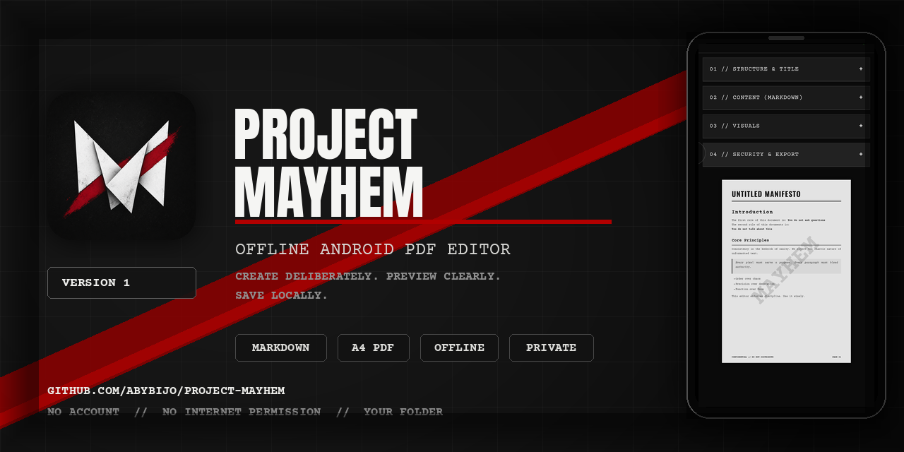
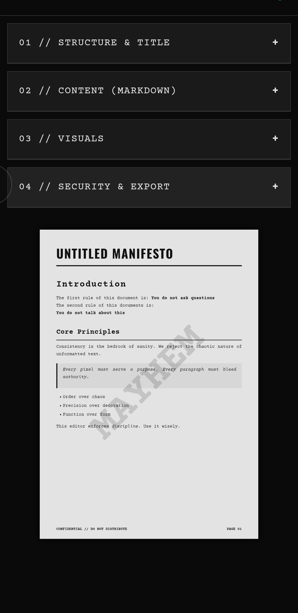
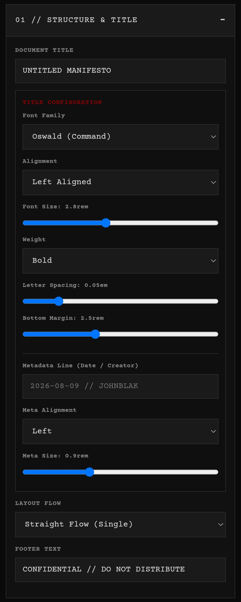
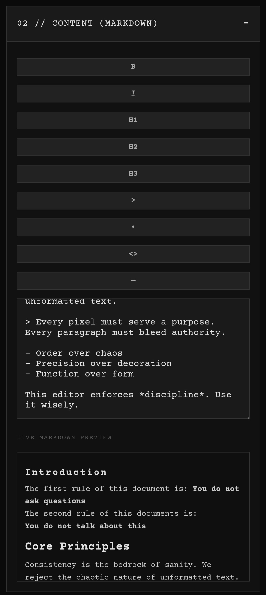
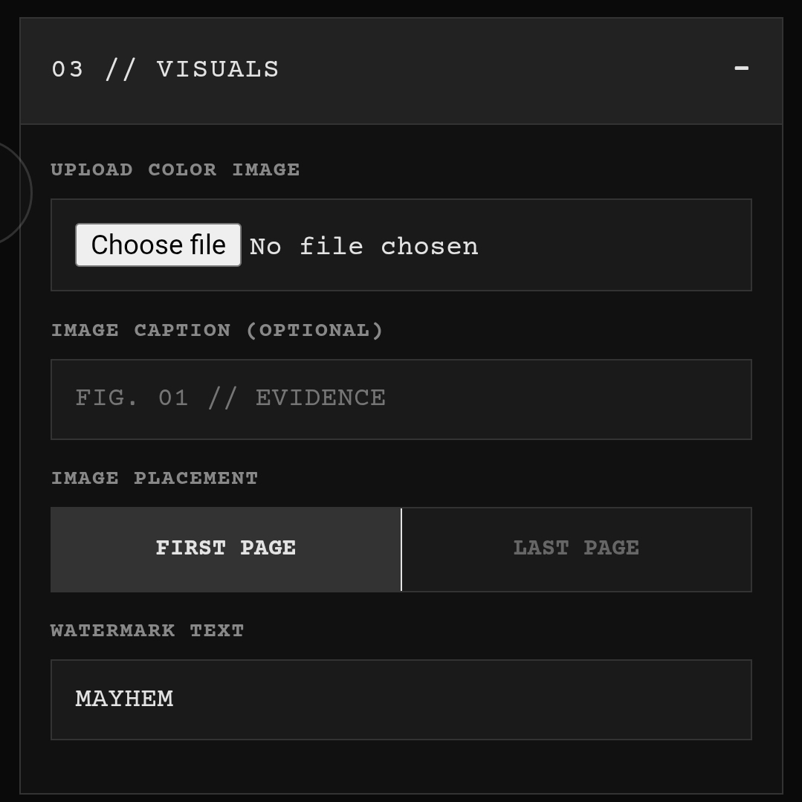
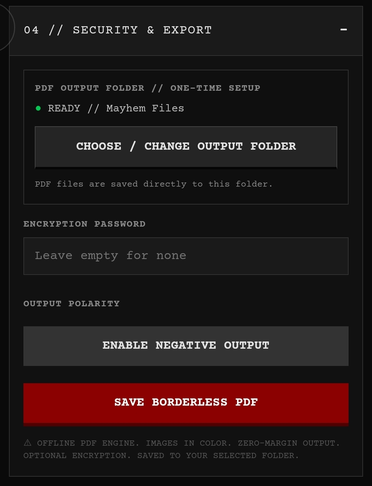

<p align="center">
  
</p>

<div align="center">

# PROJECT MAYHEM

**An offline-first Android editor for designing and saving borderless A4 PDFs.**

[](https://github.com/AbyBijo/Project-Mayhem/actions/workflows/android-ci.yml)


[](LICENSE)

[**Download**](https://github.com/AbyBijo/Project-Mayhem/releases/latest) · [**User guide**](docs/Project-Mayhem-User-Guide.pdf) · [**Report an issue**](https://github.com/AbyBijo/Project-Mayhem/issues/new/choose) · [**Contribute**](CONTRIBUTING.md)

</div>

---

## Overview

Project Mayhem is a focused Android document editor that turns structured Markdown, document metadata, an optional image, and visual controls into a finished A4 PDF. The editor provides an immediate page preview and generates the PDF locally on the device.

The app uses Android's **Storage Access Framework (SAF)**. On first launch, the user chooses an output folder and grants access to it. Project Mayhem remembers that permission and saves subsequent PDFs directly into the same folder. The destination can be changed at any time.

<p align="center">
  
</p>
<p align="center"><em>Figure 1 — Main screen with the four editing panels and live document preview.</em></p>

## Highlights

- Fully offline PDF rendering—document contents are not uploaded.
- Live A4 document preview.
- Markdown editor with formatting shortcuts and rendered preview.
- Configurable title typography, spacing, alignment, metadata, layout, and footer.
- Optional color image with caption and first-page or last-page placement.
- Custom diagonal watermark.
- Standard and negative-output modes.
- Optional PDF password protection.
- One-time output-folder setup with persistent access.
- Direct PDF saving through Android's document provider system.
- Adaptive, round, legacy, and monochrome Android icons.
- No broad storage permission and no Internet permission.

---

## Requirements

| Requirement | Details |
|---|---|
| Device | Android phone or tablet |
| Android version | Android 8.0 (API 26) or newer |
| Storage | Enough free space for the APK and generated PDFs |
| Network | Not required for editing or PDF generation |
| File access | A folder selected through the Android system picker |

---

## Installing the APK

1. Open the repository's [**Releases** page](https://github.com/AbyBijo/Project-Mayhem/releases).
2. Download `Project-Mayhem.apk` from the latest Version 1 release.
3. Open the downloaded APK.
4. If Android requests permission to install unknown apps, allow it only for the app you used to open the APK, such as your browser or file manager.
5. Review the installation screen and tap **Install**.
6. Open **Project Mayhem**.

> [!IMPORTANT]
> Download APK files only from this project's official repository or a release shared directly by the developer. Android may display a warning for an app installed outside Google Play; verify the release source before continuing.

### Optional integrity check

Compare the APK's SHA-256 digest with the checksum published beside the release:

```bash
sha256sum Project-Mayhem.apk
```

On Windows PowerShell:

```powershell
Get-FileHash .\Project-Mayhem.apk -Algorithm SHA256
```

---

## First Launch: One-Time Folder Setup

On first launch, Android displays its system folder picker.

1. Browse to the folder where generated PDFs should be stored.
2. Create a new folder if desired—for example, `Mayhem Files`.
3. Open that folder.
4. Tap **Use this folder**.
5. Confirm access when Android asks.

The **Security & Export** panel will show a green status similar to `READY // Mayhem Files`. The app stores a persistable folder grant, not unrestricted access to the device.

To use a different destination later:

1. Expand **04 // Security & Export**.
2. Tap **Choose / Change Output Folder**.
3. Select and confirm the new folder.

> [!NOTE]
> The selected location may be internal storage, an SD-card folder, or a compatible cloud/document provider. Availability depends on the providers installed on the device.

---

## Interface Tour

The editor is divided into four collapsible panels. Tap a panel header to open it; tap it again to collapse it. The page preview appears below the controls on phones and beside the controls on sufficiently wide screens.

### 01 // Structure & Title

<p align="center">
  
</p>
<p align="center"><em>Figure 2 — Structure, title typography, metadata, layout, and footer controls.</em></p>

| Control | Purpose |
|---|---|
| Document Title | Sets the main title shown at the top of page one. |
| Font Family | Selects Oswald, Bebas Neue, Anton, Share Tech Mono, or Courier Prime. |
| Alignment | Places the title on the left, in the center, or on the right. |
| Font Size | Changes the title scale. |
| Weight | Selects regular, bold, or heavy styling when supported by the font. |
| Letter Spacing | Adjusts spacing between title characters. |
| Bottom Margin | Changes the distance between the title block and body content. |
| Metadata Line | Adds an optional date, author, department, reference, or creator line. |
| Meta Alignment | Aligns the metadata independently from the title. |
| Meta Size | Controls metadata text size. |
| Layout Flow | Uses a single-column or double-column body layout. |
| Footer Text | Adds repeating text to the lower-left corner of each page. |

**Recommended workflow:** enter the title first, add a short metadata line, select the body layout, and then fine-tune title spacing while watching the page preview.

### 02 // Content (Markdown)

<p align="center">
  
</p>
<p align="center"><em>Figure 3 — Markdown toolbar, source editor, and rendered Markdown preview.</em></p>

The large text area contains the document body. Changes update both the Markdown preview and the A4 page preview.

| Toolbar button | Inserts | Result |
|---|---|---|
| **B** | `**text**` | Bold text |
| *I* | `*text*` | Italic text |
| H1 | `# Heading` | Level-one heading |
| H2 | `## Heading` | Level-two heading |
| H3 | `### Heading` | Level-three heading |
| `>` | `> Quote` | Block quote |
| `•` | `- Item` | Bulleted list item |
| `<>` | `` `code` `` | Inline code |
| `—` | `---` | Horizontal divider |

Example:

```markdown
# Project Brief

This paragraph contains **important text** and *emphasis*.

## Objectives

- Produce a clear document
- Maintain visual consistency
- Export an offline PDF

> A focused document is easier to read.

---

### Final Note

Use `inline code` for commands or identifiers.
```

For predictable pagination, divide long documents into short paragraphs and headings. Very large unbroken elements may need to be shortened so they can fit within a page.

### 03 // Visuals

<p align="center">
  
</p>
<p align="center"><em>Figure 4 — Image upload, caption, placement, and watermark settings.</em></p>

| Control | Purpose |
|---|---|
| Upload Color Image | Opens Android's file picker and imports an image into the document. |
| Image Caption | Adds optional text directly below the image. |
| First Page | Places the image before the body content on page one. |
| Last Page | Places the image after the body content on the final page. |
| Watermark Text | Places large diagonal text behind the document content. Leave empty for no watermark. |

Use a clear JPG, PNG, or other image format supported by Android WebView. High-resolution images are accepted, but extremely large files consume more memory during rendering. For faster exports, crop images to the content you actually need.

### 04 // Security & Export

<p align="center">
  
</p>
<p align="center"><em>Figure 5 — Output folder status, encryption, output polarity, and save action.</em></p>

| Control | Purpose |
|---|---|
| Output Folder | Displays the currently authorised destination. |
| Choose / Change Output Folder | Opens the Android folder picker. |
| Encryption Password | Adds password protection when a non-empty password is provided. |
| Enable Negative Output | Switches the PDF to a black-paper, white-ink appearance. |
| Save Borderless PDF | Renders every page and writes the final PDF to the selected folder. |

> [!CAUTION]
> Keep encryption passwords somewhere safe. A forgotten PDF password may make the document inaccessible. Password protection does not replace careful handling of confidential data.

---

## Creating and Saving a PDF

1. Open **01 // Structure & Title** and configure the document identity.
2. Open **02 // Content (Markdown)** and write or paste the body content.
3. Open **03 // Visuals** to add an image, caption, placement, or watermark.
4. Inspect the live A4 preview and correct any crowded content.
5. Open **04 // Security & Export**.
6. Confirm that the output-folder indicator is green and shows the correct folder.
7. Optionally enter an encryption password.
8. Optionally enable negative output.
9. Tap **Save Borderless PDF**.
10. Wait while each page is rendered. Do not close the app during this operation.
11. A confirmation message displays the folder and saved filename.
12. Open the chosen folder with a file manager to view or share the PDF.

Generated filenames begin with `PROJECT_MAYHEM`, include a cleaned form of the document title, and end with a timestamp. If the document provider detects a duplicate filename, it may create a uniquely named copy.

---

## Privacy and Storage Model

Project Mayhem is designed around least-privilege access:

- The editor and PDF libraries are bundled with the APK.
- PDF rendering happens locally on the Android device.
- The app does not request Internet permission.
- The app does not request legacy read/write external-storage permissions.
- The app can write only through the folder grant selected in Android's system picker.
- Markdown input is sanitised before being inserted into the preview.
- External page navigation is blocked inside the app's WebView.

Project Mayhem does not automatically upload generated documents. A third-party cloud folder selected through Android may sync files according to that provider's own settings and privacy policy.

---

## Troubleshooting

### The app asks for an output folder again

The previous folder grant may have been revoked, the folder may have moved, or its storage provider may be unavailable. Select the folder again through **Choose / Change Output Folder**.

### The save button reports a failure

- Confirm that the selected storage location is available and writable.
- Check free storage space.
- Choose a local folder to determine whether a cloud provider is the cause.
- Reduce very large images or shorten an unusually large document.
- Keep the app open until rendering finishes.

### The PDF is split differently than expected

Pagination uses block-level Markdown elements. Add headings and paragraph breaks, shorten oversized blocks, or switch from double-column to single-column layout.

### The image is missing

Select the image again and wait for the preview to update before saving. Try JPG or PNG if the original format is not supported by the device.

### I forgot the PDF password

Project Mayhem does not store or recover encryption passwords. Generate another copy with a known password or leave the password field empty.

### The APK will not install

- Confirm that the device runs Android 8.0 or newer.
- Ensure that the APK download completed.
- Allow installation from the specific browser or file manager used to open it.
- If a differently signed build is already installed, uninstall it only after backing up anything you need. Generated PDFs remain in the user-selected folder.

---

## Building from Source

Maintainers can follow [CONTRIBUTING.md](CONTRIBUTING.md) for the local lint and debug-build workflow. Release tagging and APK publishing are documented in [Publishing a GitHub Release](#publishing-a-github-release).

### Prerequisites

- JDK 17
- Android Studio or a command-line Android SDK installation
- Android SDK Platform 36 and Build-Tools 36.0.0
- Git

### Clone and build

```bash
git clone https://github.com/AbyBijo/Project-Mayhem.git
cd Project-Mayhem
./gradlew assembleDebug
```

The debug APK is generated under:

```text
app/build/outputs/apk/debug/app-debug.apk
```

On Windows, run:

```powershell
.\gradlew.bat assembleDebug
```

### Release signing

Release builds must be signed. Keep signing keys and passwords outside version control. The included `.gitignore` excludes common keystore and local configuration files.

A local `keystore.properties` file can contain:

```properties
storeFile=your-release-key.jks
storePassword=YOUR_STORE_PASSWORD
keyAlias=YOUR_KEY_ALIAS
keyPassword=YOUR_KEY_PASSWORD
```

Then run:

```bash
./gradlew lintRelease assembleRelease
```

> [!WARNING]
> Never commit a release keystore or real passwords. Back up the signing key securely; future updates must use the same key to install over an existing release.

### Project architecture

```text
app/
└── src/main/
    ├── assets/
    │   ├── index.html            # Editor interface and PDF workflow
    │   ├── fonts/                # Bundled document fonts
    │   └── vendor/               # Bundled PDF, canvas, Markdown, and sanitising libraries
    ├── java/com/projectmayhem/pdf/
    │   └── MainActivity.java     # WebView host, file picker, SAF folder grant, PDF writer
    └── res/
        ├── drawable*/            # Icon artwork
        ├── mipmap*/              # Launcher icons
        ├── values/               # App strings, colours, and themes
        └── xml/                  # Network and backup policies

docs/
├── images/                       # Screenshots used by this README
└── Project-Mayhem-User-Guide.pdf
```

### Important implementation details

- `WebViewAssetLoader` serves bundled assets from a controlled local HTTPS origin.
- A restricted JavaScript bridge transfers generated PDF data to native Android code.
- `ACTION_OPEN_DOCUMENT_TREE` obtains the selected folder.
- Persistable URI permission keeps the one-time folder selection available after restarts.
- `DocumentsContract` creates and writes the actual PDF in that folder.
- Release builds use resource shrinking and code minification.

---

## Publishing a GitHub Release

1. Run lint and build the signed release APK.
2. Verify the APK signature.
3. Generate a SHA-256 checksum.
4. Create a Git tag for Version 1.
5. Create a GitHub release from that tag.
6. Attach the APK and checksum file.
7. Summarise features, Android requirements, and installation steps.
8. Install the uploaded APK on a clean test device before announcing the release.

Example commands:

```bash
sha256sum Project-Mayhem.apk > Project-Mayhem.apk.sha256
git tag -a version-1 -m "Project Mayhem Version 1"
git push origin version-1
```

---

## Contributing

Bug reports and focused improvements are welcome.

1. Search existing issues before opening a new one.
2. Describe the device, Android version, and exact reproduction steps.
3. Remove passwords and confidential document content from screenshots or logs.
4. For code changes, create a branch and keep the pull request limited to one topic.
5. Run the relevant build and lint tasks before submitting.

Suggested issue details:

```text
Device:
Android version:
Project release: Version 1
What happened:
What was expected:
Steps to reproduce:
Screenshot or error message:
```

---

## License

Project Mayhem is released under the [MIT License](LICENSE).

---

## Developer

**Aby Bijo**

- GitHub: [github.com/AbyBijo](https://github.com/AbyBijo)
- Email: [abybijo1978@gmail.com](mailto:abybijo1978@gmail.com)
- Academic email: [abybijo2025bca@mac.edu.in](mailto:abybijo2025bca@mac.edu.in)

---

<div align="center">
  <strong>PROJECT MAYHEM // VERSION 1</strong><br>
  Create deliberately. Preview clearly. Save locally.
</div>
